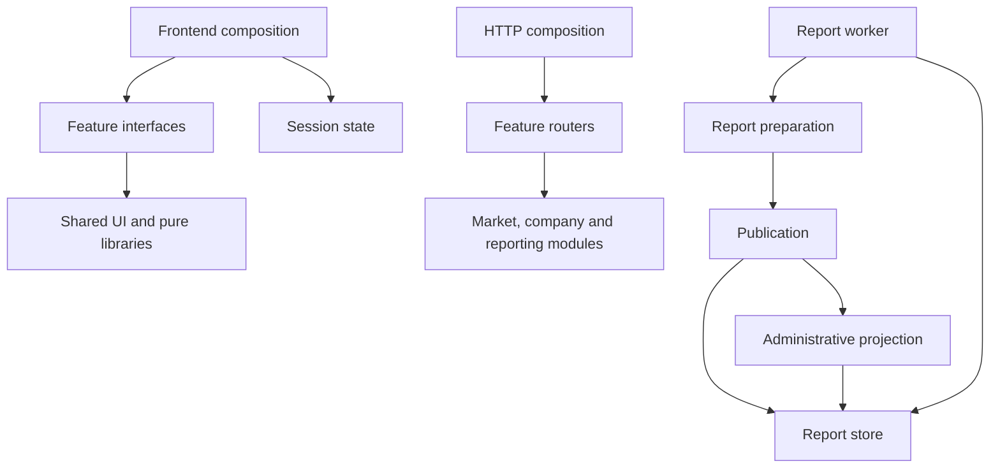

# UZStock modular architecture

UZStock is a modular monolith: one application and deployment, with feature-owned
code, explicit interfaces, and automated dependency rules. Production remains on
the uzstock.uz server. This refactor does not introduce separate services.

## Composition and ownership

`frontend/src/App.jsx` composes the application in 259 lines.
`api.py` loads configuration, composes routers and lifecycle handlers, and serves
the frontend in 236 lines. Neither owns business calculations.

| Area | Owner and interface |
| --- | --- |
| Navigation, preferences, notifications and page shell | `frontend/src/app/` |
| Market, company, charts, bonds, currency, news, events, catalog, landing, auth, profile, research, portfolio and feedback | `frontend/src/features/<feature>/index.js` |
| Session persistence and authenticated requests | `frontend/src/session/session.js`, with its React adapter `useSession.js` |
| Shared quote reconciliation | `frontend/src/lib/marketData.js`: `prepareMarketRows`, `marketTone` |
| Shared presentation and financial vocabulary | `frontend/src/shared/`; existing pure libraries remain in `frontend/src/lib/` |
| Authentication and access rules | `server/auth/access.py`, `limits.py`, `oauth.py`, `routes.py` |
| Accounts and notifications | `server/accounts/` |
| Market board, history, valuations and chart patterns | `server/market/`; existing formula engines remain independent modules |
| Company statements | `server/company/financials.py`: `financial_series`, `financial_passport`; HTTP translation in `financial_routes.py` |
| News, catalog, bonds, currency, research, audit, ingestion and system routes | Respective packages under `server/` |
| Process lifetime and background task shutdown | `server/lifecycle.py` |
| Issuer identity and source snapshots | `issuer_financials.py` |
| Report preparation | `sector_report_service.py` and existing analytical engines |
| Report persistence, queue leases, overrides and rollback | `reporting/store.py` |
| Report publication and recoverable administrative projection | `reporting/publication.py` |
| Bounded report execution | `reporting/worker.py`; `analysis_monitor.py` is its CLI entry point |

Existing parser, formula and storage modules remain cohesive implementation
modules. Their filenames were not changed solely to move them into directories.



## Enforced rules

- Frontend consumers use a feature's `index.js`; internal files can use siblings.
- Shared UI, libraries and session code cannot depend on features or the shell.
  Features cannot import `App.jsx`.
- Backend modules cannot import `api.py` or the report CLI. Domain and persistence
  code cannot depend on HTTP adapters or worker execution.
- Frontend and application/reporting dependency cycles fail automated checks.
- Tests patch the owning adapter or module. There is no compatibility container
  forwarding arbitrary old `api` globals.
- Report persistence commits before administrative projection. Projection failure
  is logged and recoverable by administrative reindexing.

`tests/architecture.test.js` checks frontend imports, including lazy imports.
`tests/test_architecture.py` checks backend direction and cycles.

## Preserved behaviour and repairs

Feature controllers stay mounted for the application lifetime. Navigation does
not discard login inputs, market filters, profile drafts or research results.
Hidden workspace redirects and the old `/bonds` link retain their behaviour.

The release is based on production commit `e225123`, including 158 commits added
after the original September 11 refactor baseline. Current email verification,
password security, account menus, interactive charts, pattern alerts, financial
scope handling and ingestion safeguards are retained. Issuer reports preserve
the current production public-access policy.

All 459 registered HTTP paths/methods/access dependencies are preserved in
`tests/fixtures/http_routes.json`. Versioned aliases also retain custom issuer
error translation. Watchers, warm-up tasks and market/bond refresh tasks are
cancelled and awaited at shutdown.

The old backend failures were repaired: data-contract tests explicitly opt into
authentication; company metadata joins registry information without overwriting
live identity; audit-withheld figures retain their display candidate while staying
excluded from ranking/export; package scans exclude archived source evidence.

## Verification

Use the project `implementation-qa` skill after implementation changes.

```text
npm run test:unit
npm run lint
npm run build
python -m pytest tests -q
python scripts/check_server_requirements.py
```

CI requires the complete backend suite, frontend architecture/unit checks,
lint/build, and selected browser integration scenarios. The former
`continue-on-error` exception on the backend suite has been removed. Backend CI
disables `.env` loading and collectors, and uses isolated SQLite paths.

`tests/test_module_integration.py` exercises real local storage through HTTP
ingestion and market reads, route contracts, versioned errors, queue leases and
shutdown. Only the external exchange mirror is replaced in the persistence test.

## Verification record — 2026-09-26

Outcome: **PASS WITH LIMITATIONS** for the architecture refactor.

- Complete backend suite: **2,055 passed, 38 skipped**. The deployment dependency
  scanner also passed over 168 runtime modules.
- Frontend unit suite: **122 passed**, including module direction/cycle checks.
- Build passed; lint has **0 errors and 52 advisory warnings**. The main bundle
  still triggers a size advisory; module ownership alone does not add lazy loading.
- Real SQLite ingestion, persisted market reads, queue claim/recovery, task
  shutdown and all 459 route contracts passed.
- **38 distinct targeted browser scenarios passed**: 17 core scenarios,
  20 current-production feature scenarios, and one slow-refresh regression.
  They cover remembered/temporary sessions, edits/reload/logout, consistent
  quotes, chart interaction/patterns, company registry, public reports and error
  recovery, email verification, password security, notifications, financial
  scopes, mobile layouts, browser history and route aliases.
- Mobile account and light-theme chart screenshots were inspected after integration.
- Before focused repairs, the full browser run recorded **96 passes, 21 failures,
  1 skip**. The untouched production baseline recorded **90 passes, 21 failures**.
  Several older navigation, admin-selector, table and calendar checks remain
  unresolved. Counts alone do not establish identical failures; the focused
  release checks above were rerun after fixing session/report selectors and
  the slow-refresh assertion. The complete browser suite is not claimed green.
- A Windows-only directory-fsync incompatibility in document archival was fixed;
  file synchronization and create-only publication remain, with directory fsync
  retained on POSIX production systems.
- Browser APIs are mocked. PostgreSQL account persistence and the production
  container were not exercised: no local PostgreSQL server or Docker executable
  is available. The 38 backend skips include optional-parser and PostgreSQL checks.
  The deployment workflow separately builds the Linux container, inspects the
  active VPS directory/services before updating, and checks production API health.

Detailed local logs and the baseline comparison are in
`D:/projects/output/architecture-full-20260926/release/`, outside the release checkout.
